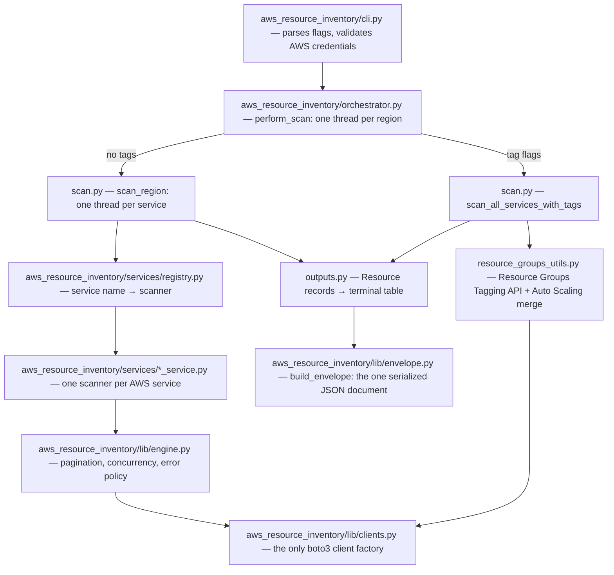

# Architecture

How `aws-inventory` turns one CLI command into a resource report. Read
this top to bottom once; each section is short.

## How a scan flows

Two paths, chosen by your flags:

1. No tag flags: every requested service is scanned with its own
   describe calls (the per-service path).
2. Any of `--tag-key`, `--tag-value`, `--all-services`: the Resource
   Groups Tagging API finds tagged resources across 100+ services (the
   tag path). Auto Scaling is not covered by that API, so its dedicated
   scanner runs too and the results are merged.

## The pieces

| Module | Job | The one fact to remember |
|---|---|---|
| `aws_resource_inventory/cli.py` | Flags, credential validation, progress display | `--verbose`/`--log-file` are global: they go before `scan`; valid credentials are required — there is no output without them |
| `aws_resource_inventory/orchestrator.py` | Fan out regions on threads | Picks per-service vs tag path |
| `aws_resource_inventory/lib/scan.py` | Fan out services per region; caching | Results cached 10 min per (region, service, tags) |
| `aws_resource_inventory/services/registry.py` | Service name → scanner + output processor | Adding a service is one entry here |
| `aws_resource_inventory/services/*_service.py` | One scanner per AWS service | Declarative ones are a `Describe` dict + 3-line function |
| `aws_resource_inventory/lib/engine.py` | Pagination, parallel collection, error guard, tag matching | Result always has exactly the requested keys; AWS errors degrade a key to `[]` with a warning, other errors surface |
| `aws_resource_inventory/lib/clients.py` | Builds every boto3 client | Connection pool 50, adaptive retries, thread-safe creation |
| `aws_resource_inventory/lib/records.py` | `Resource` — the typed record | Malformed records fail at construction, not at report time |
| `aws_resource_inventory/lib/arn.py` | Extracts a resource id out of an observed ARN | The one home for ARN id extraction — both scan paths share it |
| `aws_resource_inventory/lib/envelope.py` | `build_envelope` — Resource records → the serialized JSON document | Pure: fixtures in, dict out. The caller owns the clock and the scan parameters |
| `aws_resource_inventory/lib/outputs.py` | Records → the JSON envelope + the terminal table | Caller states the scan path via `source=` — never guessed |
| `aws_resource_inventory/lib/cache.py` | Pickle cache with 10-min TTL in `~/.cache/aws-resource-inventory` (ADR-0008) | Best-effort: any cache failure is just a miss |

## The data shape

Every scanner returns `{result_key: [raw boto3 dicts]}` (for example
`{"vpcs": [...], "subnets": [...]}`). Output processors turn those into
`Resource` records — region, resource_name, resource_type, resource_id,
resource_arn, arn_source — which both the terminal table and the
JSON envelope consume.
`resource_id` and `resource_arn` are always real values, never `"N/A"`:
where AWS returns no ARN the processor constructs one from the
`CallerIdentity` it is handed (account + partition), and `arn_source`
records which kind it is (`"observed"` | `"constructed"`). A raw dict
with no usable id or ARN is skipped with a warning, never emitted.
`resource_name` is a name AWS itself supplies (a Name/name attribute or
the `Name` tag) or null — never synthesized, never a copy of the id. The
`Name` tag has one reader, `records.name_from_tags`, used by every
producer with tags to read and by the tag-scan processor, so the same
`Name` tag yields the same name on either scan path. A name taken from a
name *attribute* is service-path only: the Tagging API returns an ARN
and tags, never the attribute (ADR-0005 Consequences).

## The serialized shape

Every scan writes one self-describing JSON document — the envelope
(`schema_version` 1, ADR-0005), built by `lib/envelope.py`:
scan metadata (tool, account, partition, regions, source, filters,
`started_at`, `duration_seconds`), a summary (`total`, `by_region`,
`by_type`), and `resources[]` sorted by region → type → id. Never a
bare array: a file nobody can trace back to an account, a region set
and a filter is not evidence.

Serialization renames the record's keys to bare ones — `region`,
`type`, `id`, `name`, `arn`, `arn_source`. The dataclass keeps its
`resource_`-prefixed attribute names; only the JSON is bare. `name` is
`null` when AWS supplies none.

`by_region` is seeded from the scanned region list, so a region that
returned nothing reports `0` instead of vanishing — the count is what
makes a partially-failed scan visible. `by_type` is not seeded:
resource types are discovered, not requested, and the tag path emits
whatever AWS returns, so there is no list to seed from.

`schema_version` bumps only on a breaking change — a renamed or removed
key, a changed type, meaning, or sort order. Additive fields never bump
it.

One subtlety: tag-path results are a hybrid. Most sections are Tagging
API shaped, but the merged Auto Scaling section carries raw service
dicts. The producer declares this (`SERVICE_SHAPED_SECTIONS` in
`resource_groups_utils.py`); the output layer routes those sections
through their registered processors instead of the generic one.

## Design rules that shaped this

1. The engine is a library the scanners call — not a framework that
   calls the scanners. Complicated scanners stay ordinary functions you
   can read top to bottom.
2. One registry, one client factory, one record type, one output
   schema. Each exists exactly once; everything else uses them.
3. AWS errors are expected and degrade gracefully (empty key plus a
   warning). Anything else is a bug and is allowed to crash.
4. Decisions live in `docs/adr/`; product direction lives in
   `PRODUCT.md`.

## Adding a service

1. Create `aws_resource_inventory/services/<name>_service.py`: a `Describe` spec dict + a
   3-line `scan_<name>` (copy `vpc_service.py`), plus a
   `process_<name>_output` that builds `Resource` records.
2. Register it: one entry in `aws_resource_inventory/services/registry.py`.
3. Test it: `tests/test_<name>_scanner.py` (moto, written failing
   first) and add the processor to `tests/test_resource_shape.py`.
4. Update the README services table.

## How changes are verified

- `poetry run pytest` — the whole suite runs without AWS credentials
  (moto fakes AWS).
- `scripts/e2e-diff.sh` — after merging, scans real AWS with the code
  before and after the merge and diffs the output. Run it plain and
  with `--tag-key/--tag-value` (the two paths are different code). It
  compares `.resources` only, sorted — `started_at` and
  `duration_seconds` are non-deterministic by design — and refuses refs
  that predate the envelope outright rather than guessing at a flat
  array.
